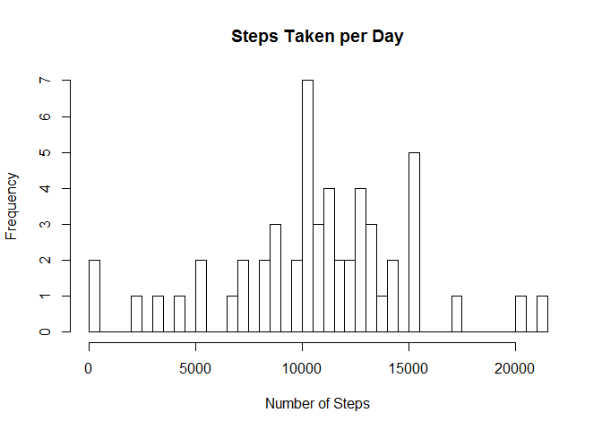
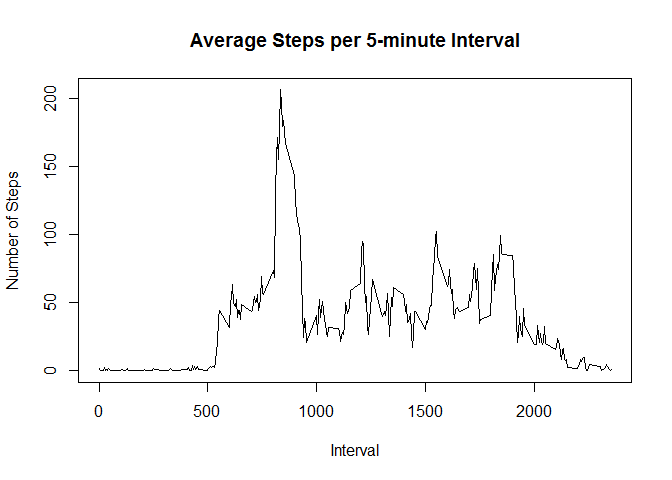
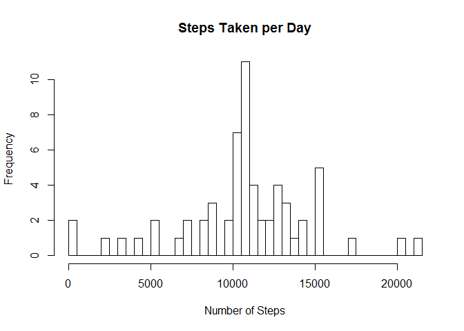

# Reproducible Research: Peer Assessment 1

## Introduction
This assignment makes use of data from a personal activity monitoring device. This device collects data at 5 minute intervals through out the day. The data consists of two months of data from an anonymous individual collected during the months of October and November, 2012 and include the number of steps taken in 5 minute intervals each day.

## Prerequisites
This R markdown document includes code chunks, we always use echo = TRUE so that someone else will be able to read the code. Be sure to have *knitr*, *ggplot2* and *dplyr* packages installed in order to reproduce results from this document.

```r
library(knitr)
opts_chunk$set(echo = TRUE, results = "hold")

library(ggplot2)
```

```
## Warning: package 'ggplot2' was built under R version 3.2.5
```

```r
library(dplyr)
```

```
## Warning: package 'dplyr' was built under R version 3.2.5
```

```
## 
## Attaching package: 'dplyr'
```

```
## Следующие объекты скрыты от 'package:stats':
## 
##     filter, lag
```

```
## Следующие объекты скрыты от 'package:base':
## 
##     intersect, setdiff, setequal, union
```


## Loading and preprocessing the data

```r
  if(!file.exists("activity.csv")) {
    unzip("activity.zip")
  }
  df <- read.csv("activity.csv", colClasses = c("integer","Date","integer"))
```
Imported data overview:

```r
str(df)
```

```
## 'data.frame':	17568 obs. of  3 variables:
##  $ steps   : int  NA NA NA NA NA NA NA NA NA NA ...
##  $ date    : Date, format: "2012-10-01" "2012-10-01" ...
##  $ interval: int  0 5 10 15 20 25 30 35 40 45 ...
```


## What is mean total number of steps taken per day?

For this particular part we intentionally do not clean up missing values.

```r
stepsPerDay <- tapply(df$steps, df$date, sum)
head(stepsPerDay)
```

```
## 2012-10-01 2012-10-02 2012-10-03 2012-10-04 2012-10-05 2012-10-06 
##         NA        126      11352      12116      13294      15420
```

We make a histogram of total number of steps per day

```r
# Larger number of breaks will make histogram look smoother
hist(stepsPerDay, breaks = 50, main = "Steps Taken per Day", xlab = "Number of Steps")
```

<!-- -->

Now we calculate and report the *mean* and *median* total number of steps taken per day

```r
stepsPerDayMean <- mean(stepsPerDay, na.rm=TRUE)
stepsPerDayMedian <- median(stepsPerDay, na.rm=TRUE)
```
Mean is *10766.189* and median is *10765*.

## What is the average daily activity pattern?
We calculate average number of steps taken averaged across all days per given 5-minute interval:

```r
stepsPerInterval <- tapply(df$steps, df$interval, mean, na.rm = TRUE)
head(stepsPerInterval)
```

```
##         0         5        10        15        20        25 
## 1.7169811 0.3396226 0.1320755 0.1509434 0.0754717 2.0943396
```
And plot number of steps per interval:

```r
plot(names(stepsPerInterval), stepsPerInterval, type = "l", main = "Average Steps per 5-minute Interval",
     xlab = "Interval", ylab = "Number of Steps")
```

<!-- -->

We find interval with maximum number of steps:

```r
intervalMax <- which.max(stepsPerInterval)
```

Interval *104* has maximum average of *206* steps.


## Imputing missing values
To remove possible bias in calculations or summaries of the data we will remove NA values from the original dataset.

We find number of NA values in the dataset:

```r
naValuesNum <- sum(is.na(df$steps))
```

Original dataset has *2304* NA values.

We replace missing values with the mean value at the same interval across days:

```r
#dplyr functions are utilized to ease up things
dfClean <- df %>% group_by(interval) %>%
    mutate(steps = replace(steps, is.na(steps), mean(steps, na.rm=TRUE)))
head(dfClean)
```

```
## Source: local data frame [6 x 3]
## Groups: interval [6]
## 
##       steps       date interval
##       (dbl)     (date)    (int)
## 1 1.7169811 2012-10-01        0
## 2 0.3396226 2012-10-01        5
## 3 0.1320755 2012-10-01       10
## 4 0.1509434 2012-10-01       15
## 5 0.0754717 2012-10-01       20
## 6 2.0943396 2012-10-01       25
```

Check that no NA values exist in mutated column:

```r
sum(is.na(dfClean$stepsClean))
```

```
## Warning in is.na(dfClean$stepsClean): is.na() применен к не-списку/вектору
## типа 'NULL'
```

```
## [1] 0
```

We make a histogram of total number of steps per day with NA values imputed:

```r
stepsPerDayClean <- tapply(dfClean$steps, dfClean$date, sum)
head(stepsPerDayClean)
# Larger number of breaks will make histogram look smoother
hist(stepsPerDayClean, breaks = 50, main = "Steps Taken per Day", xlab = "Number of Steps")
```

<!-- -->

```
## 2012-10-01 2012-10-02 2012-10-03 2012-10-04 2012-10-05 2012-10-06 
##   10766.19     126.00   11352.00   12116.00   13294.00   15420.00
```

Now we calculate and report the *mean* and *median* total number of steps taken per day with NA values imputed:

```r
stepsPerDayCleanMean <- mean(stepsPerDayClean)
stepsPerDayCleanMedian <- median(stepsPerDayClean)
```
Mean is *10766.189* and median is *10766.189*.
We see that the values after imputing the data mean and median are equal.


## Are there differences in activity patterns between weekdays and weekends?

First we create a new factor variable in the clean dataset with two levels – “weekday” and “weekend” indicating whether a given date is a weekday or weekend day:

```r
# don't use weekdays() since int's not culture invariant
dfClean <- dfClean %>% mutate(weekend = ifelse(as.POSIXlt(date)$wday %in% c(0,6), "weekend", "weekday"))
head(dfClean)
```

```
## Source: local data frame [6 x 4]
## Groups: interval [6]
## 
##       steps       date interval weekend
##       (dbl)     (date)    (int)   (chr)
## 1 1.7169811 2012-10-01        0 weekday
## 2 0.3396226 2012-10-01        5 weekday
## 3 0.1320755 2012-10-01       10 weekday
## 4 0.1509434 2012-10-01       15 weekday
## 5 0.0754717 2012-10-01       20 weekday
## 6 2.0943396 2012-10-01       25 weekday
```

Next we provide panel plot comparing the average number of steps per 5-minute interval across weekdays and weekends:

```r
# use aggregate to receive data frame, since ggplot works with data frames only
stepsPerDayWeekend <- aggregate(steps ~ interval + weekend, data = dfClean, mean)
ggplot(stepsPerDayWeekend, aes(x = interval, y = steps)) + 
        geom_line() + 
        facet_wrap(~ weekend, nrow=2, ncol=1) +
        labs(x="Interval", y="Number of Steps")
```

<!-- -->
